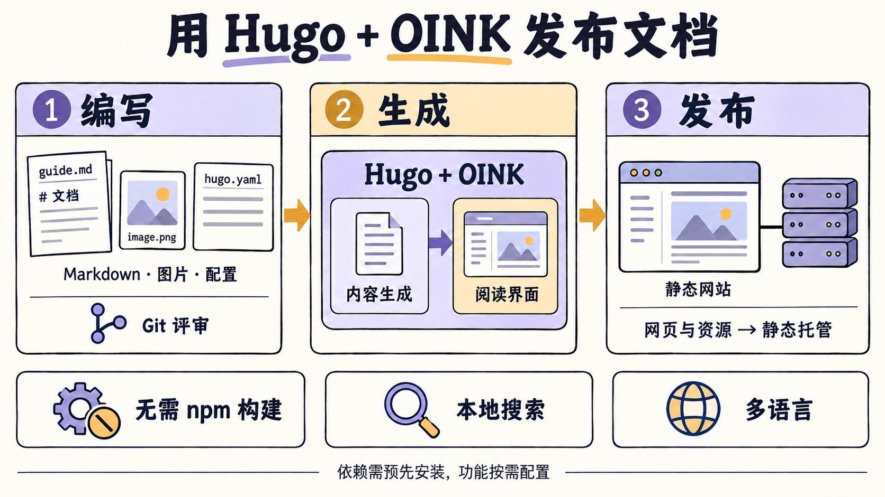
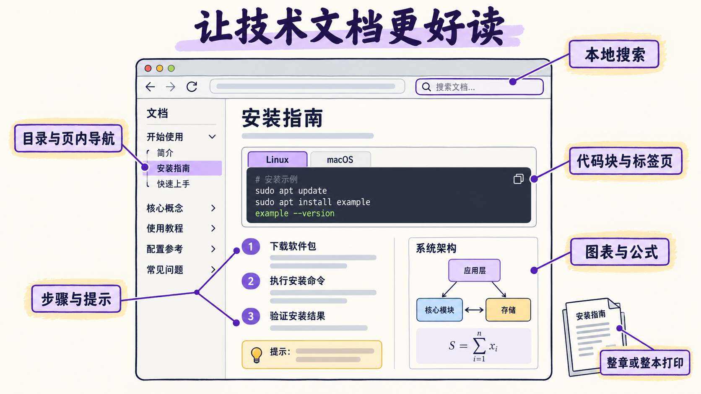
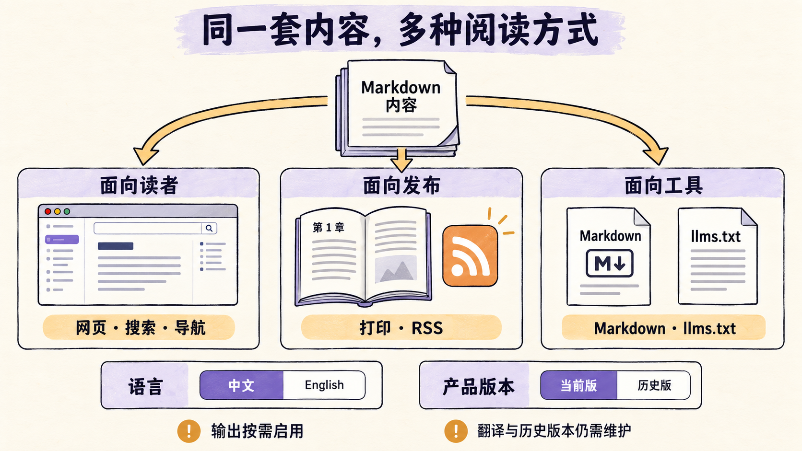
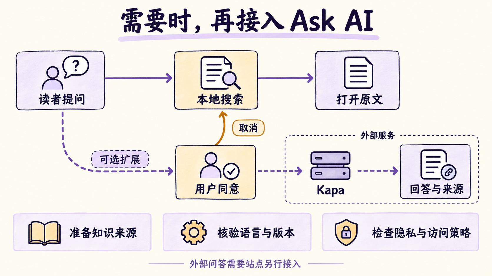

# 会写 Markdown，就能开始的文档网站

一个开发项目的文档，往往从 README 开始。安装说明、配置参数和使用示例逐渐多起来，就需要目录、搜索和独立页面；有了不同语言的读者，还要安排翻译。Hugo + OINK 可以把这些 Markdown 组织成一套完整的网站，让开发者沿用熟悉的文件与 Git 工作方式，不用先搭一套前端应用。

我对照了 OINK 的官方文档和入门模板。这套组合值得关注的地方，是把技术内容常用的阅读功能准备得比较齐全，同时让构建与部署保持简单。下面的图片均为功能示意，界面与示例命令不代表实际产品页面。



Hugo 是静态网站生成器，负责读取内容并生成网页。OINK 是配合它使用的主题，提供文档布局和交互组件。对作者来说，可以把两者当成一套文档发布工具使用。你维护正文和配置，构建得到 HTML、样式、脚本等文件，再将它们放到静态网站托管服务上。普通文档访问无需运行内容管理后台或数据库。

这让文档能直接进入代码评审流程。一段说明改了什么，Git 中看得见；发布前可以在本地预览，出错后也能回退源文件。网站内容留在项目自己的目录里，团队可以选择托管平台。OINK 的普通站点构建不要求安装 Node.js、npm 或 PostCSS，字体、图标和相关交互资源随主题提供。首次使用仍需准备 Hugo、主题及必要依赖，另行接入的外部服务也有自己的网络要求。[Hugo 官方介绍](https://gohugo.io/about/introduction/)与 [OINK 项目说明](https://github.com/pgsty/oink)解释了这套构建方式。

文档好不好用，还要看读者进来以后能不能找到内容。

OINK 提供侧栏目录、页内大纲和面包屑，长文可以按章节定位，读完一页也有前后页入口。桌面和手机共用同一套内容，界面会适应屏幕。对内容较多的项目，这些导航能让安装指南、概念解释和参数参考各有位置，读者不用在一个很长的 README 里反复滚动。



搜索可以留在浏览器里完成。启用 OINK 的本地搜索后，Hugo 在构建时为不同语言生成索引，浏览器下载索引，再查询相关页面，无需单独部署搜索服务器。站点可以选择索引标题、摘要或完整正文。小型文档用全文索引容易起步，内容增长以后则要权衡索引大小和首次加载时间。中文搜索也值得用实际问题试一遍，给文档补上常用术语和别名，比只检查搜索框能否打开更有用。具体选项见[搜索说明](https://oink.pgsty.com/docs/customize/search/)。

写技术内容时，组件能省掉不少排版工作。一份安装指南可以把 Linux 和 macOS 的命令放进标签页，用步骤组件标出顺序，再用提示块说明前提条件。讲目录结构时有文件树，讲系统关系时可以放 Mermaid 图，数学内容也有相应支持。这些内容仍围绕 Markdown 编写，作者按需学习组件语法，不必为每个页面写一套界面代码。[组件文档](https://oink.pgsty.com/docs/components/)提供了具体写法。

内容也可以有不同的组织形式。教程适合按章节连续阅读，API 参考需要方便查字段，项目动态则适合按时间发布。OINK 提供文档、博客和书籍等页面类型，也支持 OpenAPI 文档与下载页面。一个项目因此可以把使用手册和发布信息放在同一个站点里，继续共用导航和视觉样式。



打印是一个容易被忽略的实用功能。读者可以打印当前页；站点配置整节或整本打印后，还能把分散的章节汇成连续文档，再通过浏览器保存为 PDF。培训材料、长篇教程或需要留存的操作手册，都能用到它。交互内容打印时会调整呈现方式，复杂图表仍应检查打印结果，不能只看网页正常就认为纸面也合适。[打印说明](https://oink.pgsty.com/docs/customize/print/)列出了配置与组件行为。

按需启用 Markdown 输出和 `llms.txt`，还能给工具提供更直接的文本入口。网页继续服务读者，其他程序可以读取较少界面干扰的内容。它有利于复用文档，但不会自动保证某个 AI 助手收录网站或回答正确。RSS 则给关注项目更新的人提供订阅入口。这些输出都应按用途选择，团队维护好一份正文，就能供不同阅读方式使用。

双语与多版本解决的是另外两个问题。语言切换方便不同读者访问对应译文，正文翻译仍需有人维护。产品版本切换让使用旧版本的人找到当时的说明，主题提供切换入口和归档提示，各版本的内容保存、构建与发布由站点安排。文档结构变化较大时，还要检查切换后落到哪里，避免菜单能点开却到处是失效链接。[版本说明](https://oink.pgsty.com/docs/customize/versions/)把这部分分工讲得很清楚。

HugeGraph 是其中一个实例。它用中英文内容服务不同读者，并把安装、客户端、配置等文档组织到同一站点；历史发布分支和版本清单支撑了旧版文档的构建。这样的项目能说明这套方案如何承载多组件、多版本资料。自己的项目只有一种语言、一个版本时，完全可以从更小的结构开始，无需照搬它的目录和脚本。

如果希望再加一个自然语言问答入口，可以考虑 Kapa 一类外部服务。它适合帮助读者从多篇资料中寻找答案，也需要团队准备知识来源、核验回答和处理版本差异。Hugo + OINK 的基本文档与搜索可以独立运行，Ask AI 由站点另外接入。



接入时要让读者清楚何时会连接第三方服务，并按适用要求处理同意、隐私和访问策略。语言界面与语料范围也要分别核验，中文窗口不保证只查询中文资料。Kapa 的费用、网络可达性和索引维护都属于额外成本。以 Apache 项目为例，ASF 的[隐私 FAQ](https://privacy.apache.org/faq/committers.html#can-i-use-kapaai-on-our-website-answer-machine)要求 Kapa 在用户同意后加载。普通文档站可以先把内容与搜索做好，再决定是否需要这项扩展。

把它放到其他选择旁边看，选型会更清楚。开发者维护的公开手册，通常重视 Git 评审、发布版本和界面定制；团队日常知识库还要照顾非开发人员的编辑习惯，以及成员权限和内容负责人。两种需求可以由不同工具承担，也可以组合使用。

下面按这些差异比较。表中的适用判断基于工作方式，不是性能排名，也不意味着某项能力只有一个产品具备。

| 方案 | 编辑与发布方式 | 更值得考虑的情况 | 需要承担或核对的成本 |
| --- | --- | --- | --- |
| **Hugo + OINK** | Markdown 与 Git，生成静态站点，自选托管 | 希望使用现成技术写作组件，同时简化构建依赖；还需要博客、书籍或打印输出 | 配置、部署和主题升级由团队维护；在线协作编辑与细粒度权限需另行安排 |
| **Hugo + Docsy** | Markdown 与 Hugo，可通过 Hugo Module 引入主题 | 已有 Docsy 站点及定制，或偏好它的文档结构和短代码组件 | 按当前官方流程准备 npm 资源和 Dart Sass；迁移主题时检查模板与内容语法 |
| **Docusaurus** | Markdown／MDX 与 React，走 Node.js 构建流程 | 团队熟悉 React，需要在文档里嵌入自定义交互，并使用文档版本管理 | 维护前端依赖与组件；版本快照增多也会增加内容和构建负担 |
| **VitePress** | Markdown 中使用 Vue 组件，构建为可部署的静态站点 | 团队熟悉 Vue，希望文档直接复用 Vue 交互组件 | 接受 Vite／Vue 工具链，按项目需要补齐发布与内容管理流程 |
| **MkDocs + Material** | Markdown、YAML 与 Python 工具链，可自选托管 | 已有 MkDocs 内容和插件，团队熟悉其写作流程 | Material 已进入维护模式；新项目还应评估 Zensical，并检查所需插件的兼容性 |
| **GitBook** | 在线可视化编辑，可结合 Git Sync 发布文档 | 开发者与技术写作者一起维护对外文档，希望少管构建和托管 | 核对套餐、定制范围以及 Git 同步和内容导出的限制 |
| **BookStack** | 自托管 Wiki，支持可视化与 Markdown 编辑，按书、章、页组织 | 希望自己托管内部文档，并使用内置角色权限和身份认证 | 运维应用与数据库，安排备份、安全更新及账号管理 |

Docsy 值得单独比较，因为它与 OINK 都使用 Hugo，OINK 也起源于 Docsy，后来独立演进。两者都能组织技术文档，Docsy 已有多语言、版本入口和打印支持，也提供本地 Lunr 搜索。选 OINK 的理由需要落到具体的构建与写作体验上，不能把这些共同能力都算成 OINK 的独有优势。

| 比较点 | Hugo + Docsy | Hugo + OINK |
| --- | --- | --- |
| 构建依赖 | 当前官方流程通过 npm 获取 Bootstrap、Font Awesome 等资源，使用 Dart Sass；PostCSS 为可选项 | 普通站点构建无需 npm 或 PostCSS，相关资源随主题提供 |
| 内容组件 | 通过 Hugo 短代码编写提示块、标签页、卡片和 API 展示等内容 | 提供围绕 Markdown 的步骤、字段、文件树等组件，并组织文档、书籍等页面类型 |
| 搜索入口 | 可选本地 Lunr、Algolia 等搜索方案 | 将本地搜索与命令面板结合，可配置索引范围与页面关键词 |
| 采用与迁移 | 已有模板覆盖和短代码使用稳定时，继续维护可避免迁移成本 | 看重其组件和构建方式时可试用，但必须核对配置、短代码及本地模板的差异 |

以上按当前[安装依赖](https://www.docsy.dev/docs/get-started/docsy-as-module/installation-prerequisites/)、[Docsy 组件](https://www.docsy.dev/docs/content/shortcodes/)和[搜索文档](https://www.docsy.dev/docs/content/search/)核对。OINK 的[项目说明](https://github.com/pgsty/oink)也明确要求迁移时检查兼容性。已有 Docsy 网站可以先选一篇包含代码标签页、图表和打印内容的文档，在两套主题下比较作者要改多少、读者使用起来是否更方便，再决定是否迁移。

若团队已经会用 React，文档里又需要可操作的演示，Docusaurus 的 MDX 能直接嵌入 React 组件，文档插件也有版本快照流程。Vue 团队可以优先试 VitePress，它允许在 Markdown 中使用 Vue 组件。Hugo + OINK 的吸引力在于现成的内容组件和较少的构建依赖；已有前端组件需要复用时，沿用团队熟悉的框架往往更省事。相关能力可分别查阅 [Docusaurus 的 MDX](https://docusaurus.io/docs/markdown-features/react)、[版本管理](https://docusaurus.io/docs/versioning)和 [VitePress 介绍](https://vitepress.dev/guide/what-is-vitepress)。

本地搜索、Markdown 和静态部署也并非 OINK 独有。Material for MkDocs 同样提供浏览器端搜索，已有站点运行良好时，没有必要只为这些功能迁移。截至 2026 年 9 月核对，维护者已宣布将开发重点转向 Zensical。准备新建站点的团队，应把项目维护状态和插件适配纳入评估，而不能只看主题截图。可对照其[搜索实现](https://github.com/squidfunk/mkdocs-material/blob/master/docs/plugins/search.md)、[维护说明](https://squidfunk.github.io/mkdocs-material/blog/2025/11/11/insiders-now-free-for-everyone/)与 [Zensical 迁移文档](https://zensical.org/docs/compatibility/mkdocs/migration/)。

GitBook 提供了另一种取舍。作者可以在网页编辑器里改内容，开发者也可以使用 Git Sync，团队减少了自己维护发布工具的工作。选型时可以拿一份真实文档试编辑、评审与导出，核对套餐和同步限制，再判断是否适合长期使用。参见 [GitBook 编辑流程](https://gitbook.com/docs/getting-started/quickstart)。

需要自托管知识库时，也不必从静态站点开始拼装账号系统。[BookStack](https://www.bookstackapp.com/)已有角色权限及身份认证，提供书、章、页的内容结构，不过它需要运行应用和数据库。Hugo + OINK 的静态部署较简单，面向个人或部门的细粒度授权则要另行设计。决定采用哪种方式，要看团队更愿意维护哪部分工作。

公开产品文档和内部知识库还可以并存。安装指南与 API 说明跟代码走 Git 评审，会议记录和未定稿方案留在协作文档平台。需要明确哪一处是正式来源，避免同一份操作手册在两个地方各改一遍。已有 Hugo 网站迁移主题时，也应先检查原有模板、组件语法和链接，别只比较新站首页。

想判断这些取舍是否适合自己，最快的办法是拿一篇现有文档试写。官方的 OINK Starter 已准备好示例内容和部署工作流，比直接从复杂项目里删文件更容易看清哪些配置是必要的。当前模板要求 Git、Go 1.27+ 和 Hugo Extended 0.165.0+，首次启动会下载固定版本的主题模块。安装环境以[模板说明](https://github.com/pgsty/oink-starter)为准。

```sh
git clone https://github.com/pgsty/oink-starter.git
cd oink-starter
hugo server
```

打开 `http://localhost:1313/`，把一篇示例替换成自己的安装指南，查看目录和搜索，再用手机宽度读一遍。模板中的项目名称、首页内容和站点地址也需要换成自己的。确认阅读效果以后，再按模板提供的流程发布到 GitHub Pages 或 Cloudflare Pages。先让这篇指南从修改到发布完整走通，就能判断后续维护是否顺手。

继续阅读可从 [OINK 官方文档](https://oink.pgsty.com/)进入；需要参考较完整的工程项目组织方式时，再看 [HugeGraph 文档源码](https://github.com/apache/hugegraph-doc)。
